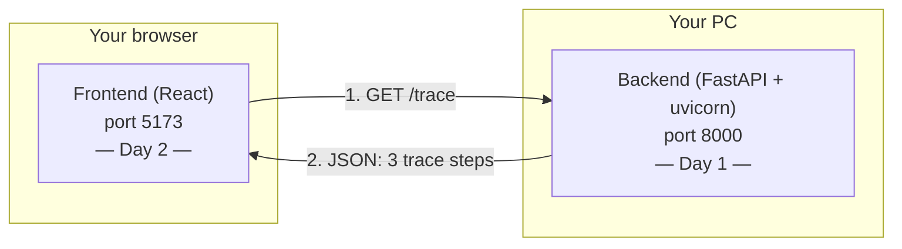
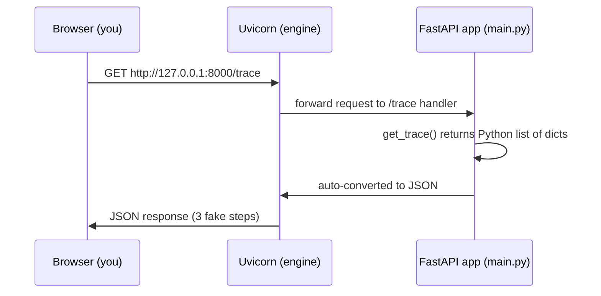

# Day 1 — Backend Skeleton (FastAPI serving fake trace JSON)

**Curriculum doc:** `docs/curriculum/01-days-1-to-5.md` (Day 1–2 block)
**Date:** 2026-08-06
**Status:** ✅ Complete — `/trace` serves honest JSON, both bugs fixed

---

## Objective (one line)

Stand up a FastAPI backend that serves 3 fake trace steps as JSON at
`/trace`, verified in the browser. (Day 2 = React frontend fetches it.)

**Done when:** `http://127.0.0.1:8000/trace` shows the 3 fake steps as raw JSON.

---

## The big picture — what the 60 days build toward

A **code visualizer**: a website where someone types Python code and sees
a step-by-step replay of what Python did — not just the output, but
"Step 1: line 1 ran, `x` became 5. Step 2: …".

That recording is called a **trace**. Analogy: an airplane's flight
recorder (black box) — it doesn't fly the plane, it just writes down
everything that happened, in order, so you can replay it later.

Today uses **fake, hardcoded trace data**. Real tracing starts Day 5.
Classic engineering move: build the connection first with dummy data, so
when something breaks later you know it's the new part, not the plumbing.

---

## Concepts & definitions

| Term | Definition | Analogy |
|---|---|---|
| **Frontend** | The program running in the user's browser — buttons, colors, text. Written in JavaScript (we'll use React). Good at *showing*, wrong place for heavy work. | Restaurant dining room |
| **Backend** | A program that sits and waits; when asked something, it answers with data. No visual appearance at all. Does the real work. | Restaurant kitchen — customers never see it, but the cooking happens there |
| **Network request** | The frontend asking the backend for something and getting data back. | The waiter carrying orders and food between dining room and kitchen |
| **JSON** | JavaScript Object Notation — structured text both Python and JS (and every language) can read/write. Curly braces `{}` = labeled data, square brackets `[]` = lists. The universal data language of the web. | The order ticket — a fixed format waiter and cook both read regardless of what language they speak |
| **FastAPI** | A Python library for building backends. You write only "when someone asks for `/trace`, here's the data"; it handles listening, parsing requests, and auto-converting Python data → JSON. Modern, fast, used in real production systems. | — |
| **Uvicorn** | The engine that keeps the FastAPI program running and listening, forwarding requests to your code. FastAPI = what to answer; uvicorn = the running building (power, lights, open doors). | FastAPI is the kitchen staff; uvicorn is the building |
| **Endpoint** | One specific address path the backend answers on, e.g. `/trace`. Each kind of question gets its own path. | A door with a name on it / the kitchen's order window |
| **`127.0.0.1`** | Special IP address meaning "this very computer" (localhost). | — |
| **Port (`:8000`)** | One computer runs many network programs; each gets a numbered slot. Backend = 8000, React dev server = 5173. | Numbered mailboxes in one building |
| **Trace** | The step-by-step recording of a program run. Step shape for this project: `step / line / event / changed / variables`. | Flight recorder / black box |
| **CORS** | Browser safety rule: a page at one address (React on 5173) is blocked from fetching data from another address (backend on 8000) unless the backend explicitly allows it. Skipping it makes the fetch fail **silently** — looks like broken code, is actually a missing permission. | — |
| **Virtual environment (`venv`)** | A private folder of Python packages just for this project, so projects don't fight over shared global package versions. | Private toolbox per project |
| **`pip`** | Python's package downloader/installer. | — |

---

## Architecture diagram



Request flow for Day 1's manual test (no frontend yet):



---

## Q&A log

**Q: I'm starting from scratch — what is FastAPI, why is it used, what is
trace, what is JSON?**
A: Covered in full above (Concepts & definitions + big picture). Key
points: two programs (frontend/backend) because showing and thinking are
different jobs; JSON is the shared written format between their two
languages; FastAPI does the network plumbing so you write only the
interesting part; uvicorn keeps it running; a trace is the black-box
recording of a program run.

**Q: How will we know which code to write and when to write it?**
A: Nobody derives code from thin air — three sources: (1) *the goal,
worked backwards* — decompose the "done when" into prerequisites (to
show JSON I need an endpoint → endpoint needs an app → app needs the
import), which dictates the writing order; the decomposition is the real
skill, typing is easy; (2) *the library's documented recipe* — patterns
like `app = FastAPI()` come from the library's docs; professionals look
syntax up constantly (nobody memorizes the CORS block) — the skill is
knowing *what to search for*; (3) *accumulated patterns* — after a few
backends the opening moves become automatic, repetition does it for
free. Cooking analogy: follow the recipe line-by-line first, glance at
it the tenth time, improvise the fiftieth — because you know what each
ingredient *does*. In this bootcamp: curriculum decides what, Claude
explains why, I must understand well enough to explain it back.

**Q (homework result): Renamed the endpoint to `/tracer`, visited
`/trace`, got `{"detail":"Not Found"}` — why?**
A: That's **status code 404** — the web's standard number for "no such
address here." Status codes label every response: `200` success, `404`
not found, `500` server crashed while answering. FastAPI returns even
its errors as JSON so a frontend can read them programmatically.

**Q: What should be in `.gitignore`?**
A: A plain-text list of patterns Git should pretend don't exist. Three
categories: (1) *regeneratable* — `venv/`, `__pycache__/`, `*.pyc`,
`node_modules/`, `dist/` — bloat anyone can rebuild (`pip install` /
`npm install`); (2) *secrets* — `.env` (API keys; committed secrets
live in git history forever, ignore from day one so the mistake is
impossible); (3) *machine noise* — `.vscode/`, `.DS_Store`. Analogy:
ship the cake recipe, not the dirty mixing bowls. Trailing `/` = folder;
`*` = wildcard; root patterns match anywhere in the repo.

**Q: Can notes be kept automatically?**
A: This folder (`docs/notes/`) + a standing rule in CLAUDE.md — every
session now auto-logs concepts, Q&A, runs, errors, and diagrams to the
day's file without being asked.

---

## Git strategy decision (Day 1, applies all 60 days)

My idea: daily commits on main + a per-day branch holding each day's
content. Decision after discussion: **one branch (main) + one tag per
day** instead.

Why: every git commit is already a *full snapshot* of the whole repo —
daily commits on main ARE the day-by-day timeline. A **branch** is a
movable pointer for work-in-progress that will change and merge; a
**tag** is a permanent frozen bookmark on one commit — exactly what
"day-01" needs to mean. 60 never-changing branches = clutter used
against its nature. Also, a branch with "only that day's files" would
not even run (Day 3 code needs Day 1–2 files); useful snapshots are
cumulative, and tags on main are cumulative snapshots with day names.
Analogy: branch = bookmark that follows you as you read; tag = page
number printed in the table of contents.

Daily ritual (I run it, after the day's "done when" passes):
```powershell
git status        # verify venv/ etc. are ignored
git add .
git commit -m "day-NN: <topic>"
git tag day-NN
git push --follow-tags   # if remote exists
```
Rewind: `git checkout day-NN` (whole repo as of that day);
`git checkout main` returns to present. `git tag` lists all bookmarks.

## Structural decision

Curriculum doc says `mkdir code-visualizer` with `backend/`+`frontend/`
inside. Repo already has `backend/` and `frontend/` at root. **Decision:
use the repo's existing folders** (`AIOS/backend/main.py`) — same
structure, no pointless nesting. Flagged as a deviation per CLAUDE.md.

---

## Today's steps

1. ✅ Create venv in `backend/`, install `fastapi` + `uvicorn`:
   ```powershell
   cd d:\sai\AI-Learning\AIOS\AIOS\backend
   python -m venv venv
   venv\Scripts\activate
   pip install fastapi uvicorn
   ```
2. ⬜ Write `backend/main.py` (I type, Claude guides): create app, add
   CORS middleware, one `GET /trace` endpoint returning 3 hardcoded steps.
3. ⬜ Run `uvicorn main:app --reload`, open `http://127.0.0.1:8000/trace`.

---

## Check your understanding (to answer before coding)

1. Why can't the frontend just do everything — why have a backend at all?
2. What problem does JSON solve?
3. What's the difference between FastAPI and uvicorn?

**My answers (2026-08-06):**

1. Frontend alone can't handle everything — it's division of labor:
   frontend shows the UI, backend handles requests and data.
   ✅ Correct. *Refinement:* there's also a trust/capability reason — the
   frontend runs in the user's browser sandbox (readable by anyone via
   dev tools, shouldn't do heavy work on a stranger's machine); anything
   private or heavy belongs on the backend, which runs under our control.
   Running user-submitted code (Day 5+) is firmly backend work.
2. Two different languages can't understand each other; JSON is the
   common language of the web for sharing data. ✅ Exactly right.
3. FastAPI is the Python library, uvicorn is the engine that runs it.
   ✅ Right idea. *Refinement:* FastAPI = the library you use to
   *describe what to answer*; uvicorn = the engine that keeps that
   description alive and listening. One describes, one runs.

---

## What we built / ran

- ✅ `python -m venv venv` + activate + `pip install fastapi uvicorn` in
  `backend/` — succeeded, no errors. `(venv)` prefix confirms the
  private toolbox is active.
- ✅ Wrote `backend/main.py` by hand in 3 pieces (imports+app, CORS
  middleware, `/trace` endpoint), with every line annotated in my own
  comments.
- ✅ `uvicorn main:app --reload` → browser at `127.0.0.1:8000/trace`
  showed the JSON. **Day 1 "done when" reached** (after bug fixes below).

## Bugs found in code review (my first real bugs!)

1. **Dishonest fake data** — step 2 had `"changed":{"x":8}` but the
   actual change that step was `y` becoming 8 (`x` stayed 5). The step
   contradicted itself; later this would make the visualizer highlight
   the wrong variable. Lesson: fake data still has to be *honest* data.
2. **`[*""]` vs `["*"]`** in `allow_headers` — the `*` outside quotes is
   Python's **unpack operator**: it spreads a string's characters into
   the list, and an empty string has none → `allow_headers=[]` (allow
   *no* headers). No error, server ran fine, browser showed JSON —
   because a plain GET sends no special headers. Would have exploded
   confusingly days later. Lesson: **"it runs" ≠ "it's right."**

## Wrap-up

**Summary:** Built and ran my first backend from zero. FastAPI app with
CORS middleware and one `GET /trace` endpoint returning 3 hardcoded
trace steps; verified as JSON in the browser. Found and fixed 2 real
bugs in code review.

**What I learned:**
- The frontend/backend split and why it exists (division of labor +
  trust/capability), JSON as the shared language, endpoints as named
  doors, FastAPI describes vs uvicorn runs, middleware as receptionist,
  CORS, venv, ports, decorators, list-of-dicts.
- How engineers know what to write: goal worked backwards + library
  docs + accumulated patterns. Syntax is looked up, not memorized.
- "It runs" ≠ "it's right" — the `[*""]` unpack bug ran fine and was
  still wrong. And fake data must be honest data.

**What we built:** `backend/main.py` (25 lines + my own comments),
venv with fastapi + uvicorn.

**Homework:**
1. Close this doc and explain `main.py` out loud, line by line, from
   the code alone (delete-and-rewrite rule applies if I can't).
2. Break it on purpose, observe, undo: stop uvicorn and refresh the
   browser (what error?); change the path to `/tracer` and visit
   `/trace` (what status?); comment out the CORS block (nothing visible
   breaks *today* — why not? Answer: CORS only gates *cross-origin*
   fetches; typing the URL directly in the browser is a normal
   same-window visit, so it only matters once React fetches on Day 2).

**Suggested commit message:** `day-01: backend skeleton serving fake trace JSON`
(I commit it myself — Claude never commits.)

**Prep for tomorrow (Day 2):** React frontend via Vite fetches `/trace`
and renders it — the other half of the skeleton. Check Node.js is
installed: `node --version` (need it for `npm create vite@latest`).
Keep the backend running or restart it tomorrow with
`uvicorn main:app --reload` from `backend/` with venv active.
