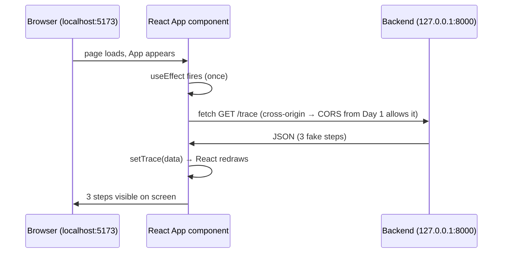

# Day 2 — Frontend Skeleton (React fetches the backend's trace)

**Curriculum doc:** `docs/curriculum/01-days-1-to-5.md` (Day 1–2 block, second half)
**Date:** 2026-08-07
**Status:** ✅ Complete — React renders the backend's 3 trace steps

---

## Objective (one line)

Build the React frontend (Vite) and make it fetch `GET /trace` from the
backend — proving the two programs talk.

**Done when:** the 3 fake steps appear on screen, fetched from my own
backend, not hardcoded in React.

---

## Concepts & definitions

| Term | Definition | Analogy |
|---|---|---|
| **Node.js** | Lets JavaScript run *outside* the browser as a normal program. Needed not for our page itself (that runs in the browser) but for the frontend tooling (dev server, installer), which is written in JS. | Node is to JavaScript what the `python` command is to Python |
| **npm** | JavaScript's package downloader. Counterpart of `pip`. Installs into `node_modules/` (the venv-equivalent, already gitignored). Writes `package.json` — a replayable shopping list of dependencies (`npm install` re-creates everything). | pip + requirements.txt in one |
| **React** | UI library. Core idea: *describe what the screen looks like for a given state of the data*; when data changes, React redraws affected parts automatically. You never manually update elements. Code is organized in **components** — functions returning what to show. | A spreadsheet: write `=A1+B1` once; the cell recomputes itself when A1 changes |
| **Vite** | Dev tool ("veet", French for fast): serves the page at `localhost:5173`, hot-reloads on save (like uvicorn's `--reload`), translates JSX → plain JS, scaffolds a starter project. | — |
| **JSX** | JavaScript with HTML-looking tags (`return <pre>...</pre>`). Not real HTML — Vite translates it. `{}` inside JSX = "insert this JS value here." | — |
| **useState** | React tool: "remember a value, and redraw the screen when it changes." | — |
| **useEffect** | React tool: "run this code automatically when the component first appears." | — |
| **fetch** | Browser's built-in function for making a network request from JS. | The waiter walking to the kitchen |

## Today's flow



Day 1's CORS block earns its keep today: page on port 5173 fetching
port 8000 is exactly the cross-origin request browsers block by default.

---

## Today's steps

1. ⬜ Check tooling: `node --version`, `npm --version`
2. ⬜ Scaffold: `cd frontend`, `npm create vite@latest . -- --template react`, `npm install`
3. ⬜ Run starter: `npm run dev` → see Vite's default page at `localhost:5173`
4. ⬜ Rewrite `src/App.jsx` (I type): useState + useEffect + fetch `/trace`
5. ⬜ Verify: backend running on 8000, frontend on 5173, JSON on screen

---

## Check your understanding — my answers (2026-08-07)

1. Why Node if the page runs in the browser? I said "browsers only
   understand JS, Node runs it outside." 🟡 Direction right (outside the
   *browser*, on the PC), but the real why: our **tooling** (Vite dev
   server, npm) is itself JS programs that must run directly on the PC.
2. React's core idea? I described the pain (manually updating 10 things
   = unmanageable). 🟡 The solution sentence: *describe what the screen
   looks like for the current data; when data changes React redraws.*
   You never update the screen manually — you only change the data.
3. Which Day 1 line matters today? CORS ✅ but I missed why: yesterday I
   visited the backend *directly* (address bar = normal visit, CORS
   doesn't apply). Today a **page** from `localhost:5173` runs JS that
   fetches a *different* origin (`127.0.0.1:8000`) — browsers block
   cross-origin fetches by default (else malicious pages could silently
   probe e.g. your bank); the target server must announce "pages from
   other origins allowed," which is exactly what the CORS middleware
   adds to every response.

Tooling check ✅: node v20.19.0, npm 11.10.0.

## Q&A log

**Q: Is React "similar to JS" and does it refresh only the pages whose
data changed?**
A: Two corrections: (1) React *is* JavaScript — a library written in it
(like FastAPI is Python), not a parallel language. (2) Finer than
pages: within one page, React redraws only the individual *pieces*
(components/elements) whose data changed — header stays, step list
redraws. One sentence: describe each piece of the screen as a function
of some data; when that data changes, only dependent pieces redraw.

**Q: What are useState and useEffect, their differences, when to use
and not use each — with real examples?**
A:
- **useState = the component's memory (the noun: data).** Components
  are functions that re-run on every redraw; normal variables would
  reset. `const [trace, setTrace] = useState(null)` = a value that
  survives redraws + `setTrace` as the *only legal way* to change it —
  the setter is the trigger that tells React "redraw dependents."
  Change data any other way → React never notices → stale screen.
  Examples: Instagram like button (`liked`), search box text, our
  fetched trace. **Don't use for derivable values**: no
  `stepCount` state next to `trace` — two copies of one fact drift
  apart; write `trace.length`. State = facts only you know.
- **useEffect = do a side-job at controlled moments (the verb:
  action).** Side effects = reaching outside the component (fetch,
  timers, listeners). `useEffect(() => {...}, [])` = "run once, after
  first appearing." The `[]` dependency list controls re-runs
  (`[snippetId]` = re-run when it changes). **Why not fetch in the
  body?** Body re-runs every redraw: fetch → setTrace → redraw → fetch
  → infinite request loop. Examples: WhatsApp Web loading chats on
  open, a clock starting its timer. **Don't use for user actions**
  (clicks get `onClick` handlers) or derived data.
- **Teammates, not alternatives:** today's App is literally *useEffect
  fetches, useState remembers* — effect runs once, calls `setTrace`,
  React repaints.

**Q: Do I have to memorize `const [trace, setTrace] = useState(null)`?
How would I know the first item is the value?**
A: No memorizing — the line is two ordinary JS features composed:
1. `useState(null)` is *just a function call* (like `ast.parse(code)`);
   argument = starting value; it **returns a pair**: `[currentValue,
   setterFunction]`. Verbose equivalent: `const r = useState(null);
   const trace = r[0]; const setTrace = r[1]`.
2. `const [a, b] = ...` is **destructuring** — unpacking a two-item box
   into two named variables (Python's `x, y = get_pair()`).
The names are mine (`[banana, setBanana]` works identically) —
*position* is what matters: first = value, second = setter.
`thing/setThing` is just the readability convention.
How I'll "know" it: (1) recognition through repetition — this shape is
in every React component, fingers learn it like `x = 5`; (2) look it up
when forgotten (react.dev) — the skill is knowing what to search;
(3) understanding is the backup: remember the *idea* (returns value +
setter pair) and the syntax reconstructs itself. Memorized syntax
evaporates; understood syntax regrows.

**Gotcha (PowerShell + npm):** `npm create vite@latest . -- --template
react` forwarded the args as `create-vite . react` — the `--template`
flag got eaten (PowerShell and npm disagree over the `--` separator;
works fine in bash). Fix: just answer Vite's interactive menu — React →
JavaScript variant (not TypeScript: stricter typed JS flavor, good but
not what the curriculum uses).

## What we built / ran

- ✅ Vite scaffold via interactive menu (React → JavaScript → ESLint) —
  project files created (`src/`, `package.json`, `vite.config.js`,
  `index.html`).
- ❌ Auto-install died mid-download: **`ECONNRESET`** = network
  connection reset while npm pulled packages (internet hiccup or
  proxy/firewall). The `EPERM`/`ENOTEMPTY` cleanup warnings were
  side-noise: Windows file-locking (antivirus scanning fresh files)
  while npm tried to tidy its half-downloaded mess — not the root
  cause. **Lesson: read errors bottom-up for the root `npm error`,
  don't panic at warning walls.**
- 🔁 Recovery: `Remove-Item -Recurse -Force node_modules` +
  `npm install` — safe because `package.json` is the shopping list and
  `node_modules/` is 100% regeneratable (why it's gitignored). Worked;
  demo page loaded (its "Count is 0" button = useState live: somewhere
  a `const [count, setCount] = useState(0)` + `setCount(count+1)`).
- ✅ Rewrote `src/App.jsx` (typed myself): useState(null) + useEffect
  fetch → `.then(res => res.json())` → `.then(data => setTrace(data))`
  → `<pre>{JSON.stringify(trace, null, 2)}</pre>`.
  New concepts hit while typing: **arrow functions** (`() => {}` =
  nameless function, Python lambda), **promises/.then** (fetch returns
  immediately with "reply comes later"; chain reads *fetch → when
  replied, parse → when parsed, save*), `<pre>` = preformatted text,
  `JSON.stringify(x, null, 2)` = JS twin of `json.dumps(x, indent=2)`.
- ✅ Both servers up (uvicorn :8000 + vite :5173) → **the 3 steps
  render as indented JSON in the browser. Day 2 "done when" met.**

## Wrap-up

**Summary:** Scaffolded the React frontend with Vite (surviving an
ECONNRESET mid-install), rewrote App.jsx from scratch, and completed
the full skeleton: React on :5173 fetches JSON from FastAPI on :8000
and renders it. The Day 1–2 curriculum block is done.

**What I learned:**
- Node/npm/Vite/React/JSX roles; useState (memory + redraw trigger) vs
  useEffect (side-jobs at controlled moments) and why fetch can't live
  in the component body (infinite request loop).
- Destructuring: `const [trace, setTrace] = useState(null)` is a
  function returning a pair, unpacked — understood, not memorized.
- Promises: `.then` chains for "when it arrives, do this."
- Real-world debugging: root cause reads bottom-up (ECONNRESET), warning
  walls (EPERM cleanup noise) aren't the root cause; broken
  node_modules is disposable by design.
- CORS finally made sense: address-bar visits aren't cross-origin;
  a page's JS fetching another origin is.

**What we built:** `frontend/` (Vite React app), rewritten
`src/App.jsx` (15 lines, every one explainable).

**Homework:**
1. Explain App.jsx line by line from the code alone (delete-and-rewrite
   rule applies).
2. Break it and watch the failures — press **F12** (browser DevTools) →
   Console tab first:
   a. Stop uvicorn (Ctrl+C), refresh :5173 → blank page + red
      `Failed to fetch` in console. Restart uvicorn.
   b. In `main.py`, comment out the `app.add_middleware(...)` block,
      refresh :5173 → **the CORS error, finally live**: blocked by CORS
      policy, no 'Access-Control-Allow-Origin' header. The silent
      killer made visible. Uncomment it after (verify the page works
      again).

**Suggested commit ritual:**
```powershell
git add .
git commit -m "day-02: react frontend fetches trace from backend"
git tag -a day-02 -m "Day 2: react frontend fetches trace from backend"
git push --follow-tags
```
(Check `git status` first — frontend/node_modules must NOT appear;
Vite also generated its own frontend/.gitignore which covers it.)

**Prep for tomorrow (Day 3):** Reading code as a tree — Python's `ast`
module (`ast.parse`, `ast.dump`), the first real step toward the
tracer. No new installs needed; just the backend venv's Python. Neither
server needs to run for Day 3.
