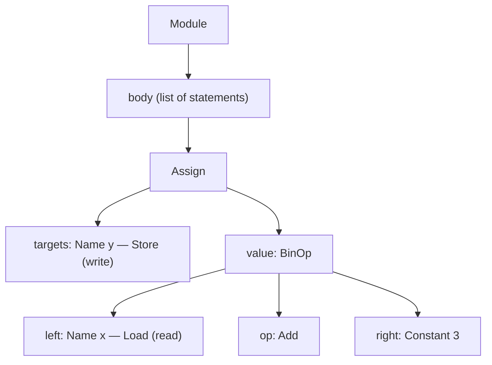

# Day 3 — Reading Code as a Tree (the `ast` module)

**Date:** 2026-08-10
**Curriculum doc:** `docs/curriculum/01-days-1-to-5.md` → Day 3 block

## Objective

Use Python's built-in `ast` module to see the *structure* of code —
so the tracer can later understand `x = 5` instead of just reading it
as text.

## Concepts & definitions

- **AST (Abstract Syntax Tree)** — the structure of code, written out
  as data. Analogy: grammar for a sentence. "The dog ate the bone" is
  just words until you label it: subject = dog, verb = ate,
  object = bone. `ast.parse` does that labeling for Python code:
  `x = 5` becomes "an Assign: target = x, value = 5."
- **`ast.parse`** — takes code as text, returns the tree.
- **`ast.dump`** — prints the tree object in readable form.
- **`Module` / `body`** — the whole snippet / the list of statements
  inside it.
- **`Assign` node** — "this line is an assignment." `targets` = who is
  written to (a list, because `x = y = 5` is legal); `value` = what is
  assigned.
- **`ctx=Store()`** — this name is being **written to**.
- **`Constant`** — a literal value typed in the code (the `5`).
- **`BinOp`** — binary operation, "binary" = two sides:
  `left` / `op` / `right` (e.g. `x + 3` → Name x, Add(), Constant 3).
- **`ctx=Load()`** — this name is being **read from**. Analogy:
  notebook — Store = writing on a page, Load = looking a page up.
  `y = x + 3` has both on one line: Store on y, Load on x.
- Tree shape insight: BinOp sits *inside* Assign's `value`; x and 3
  sit *inside* BinOp — things inside things = the "tree."
- **String** (from Sai's guess) — a *kind of data*: text in quotes.
  `x = "hello"` would be `Constant(value='hello')` — just another
  constant, not a node type.
- **`Call`** — a function is being called. `func` = which function
  (`Name(id='print', ctx=Load())` — the function name is *read* like
  a variable); `args` = list of arguments passed in; `keywords` =
  named args like `end=""` (empty for us).
- **`Expr`** — wrapper meaning "this line is an expression standing
  alone" — produces a value, stores it nowhere. Bare `print(y)` gets
  wrapped in it; recognize, don't memorize.

## Q&A log

- Predict-before-run on `y = x + 3`: Sai guessed "arithmetic" for the
  value node (→ correct instinct; Python calls it `BinOp`) and passed
  on the Store→Load twin (→ revealed: `Load` = read). Ran it and
  correctly located all three: BinOp, Load on x, Store on y.
- Predict on `print(y)`'s node name: Sai guessed "string" → used the
  miss to separate *data* (string = text in quotes) from *action*
  (calling a function = `Call`). Ran it; hunted down `func=` and
  `args=` successfully.

## What we built / ran

- Created `backend/explore_ast.py` (Sai typed it): `show_tree(code)`
  helper → `ast.parse` + `ast.dump(indent=2)`.
- Ran `python .\explore_ast.py` in the venv — tree for `x = 5` printed
  correctly; Sai's run worked first try.
- Read the `x = 5` tree line by line together.
- Added `show_tree("y = x + 3")` and `show_tree("print(y)")` — all
  three curriculum trees printed and read together.
- Final check passed — see Check-your-understanding.

## Diagram — how `y = x + 3` nests



## Check-your-understanding

- Done when: Sai can look at the tree for `x = 5`, `y = x + 3`, and
  `print(y)` and explain each one out loud, in their own words,
  without looking at the curriculum doc.
- **Result: PASSED.** Sai's answers (terminal only, no doc):
  1. `x = 5` → "value 5 is getting stored in id called x, 5 is
     Assign to x" ✓
  2. `y = x + 3` → "y is Storing BinOp Add with x and constant 3" ✓
     (polish added: x is `Load` — read so its value feeds the math)
  3. `print(y)` → "print is Load that's printing y" — passed with
     upgrade: the key word is **call** — "call the function print,
     passing y in." Load on print is a lookup detail; the event is
     the Call. Tracer will treat read-a-name vs call-a-function as
     different actions later.

## Wrap-up

- **Summary:** First day inside the tracer's real machinery. Built
  `backend/explore_ast.py` and used `ast.parse` + `ast.dump` to see
  three code snippets as trees. Method all day: predict → run →
  read the output together.
- **Learned:** AST = code's structure as data (grammar-for-code
  analogy); nodes met: Module/body, Assign (targets + value),
  Name with Store (write) vs Load (read), Constant, BinOp
  (left/op/right), Call (func + args), Expr wrapper. Bonus: a string
  is just a Constant; a function name is Load-ed like a variable.
- **Built:** `backend/explore_ast.py` — `show_tree()` helper +
  three example snippets. No servers needed today.
- **Homework (optional, stays in Day 3 scope):** feed `show_tree`
  your own snippets and read the output before believing it —
  try `x = "hello"` (string Constant), `z = x * y` (what replaces
  `Add()`?), `print(x, y)` (what happens to `args`?).
- **Commit ritual:**
  ```powershell
  git add .
  git commit -m "day-03: explore python ast trees"
  git tag -a day-03 -m "Day 3: explore python ast trees"
  git push --follow-tags
  ```
- **Homework results (done same day):**
  1. `x = "hello"` — guessed "text" ✓ → `Constant(value='hello')`;
     one Constant node type holds any literal.
  2. `z = x * y` — guessed "x and y, mul" ✓✓ → `op=Mult()` AND
     `right` became `Name(Load)` — either BinOp side can be a
     constant or a variable.
  3. `print(x, y)` — `args` list now holds two `Name(Load)` entries.
  - Bonus self-experiment (unprompted): changed `y = x + 3` to
    `y = x - 3` → discovered `op=Sub()`. Has now seen Add/Sub/Mult
    first-hand.
- **Prep for tomorrow (Day 4):** upgrade `explore_ast.py` into an
  interactive tool (type any code, see its tree) and preview three
  shapes needed later: `if/else`, `while`, `def`. No installs, no
  servers.
