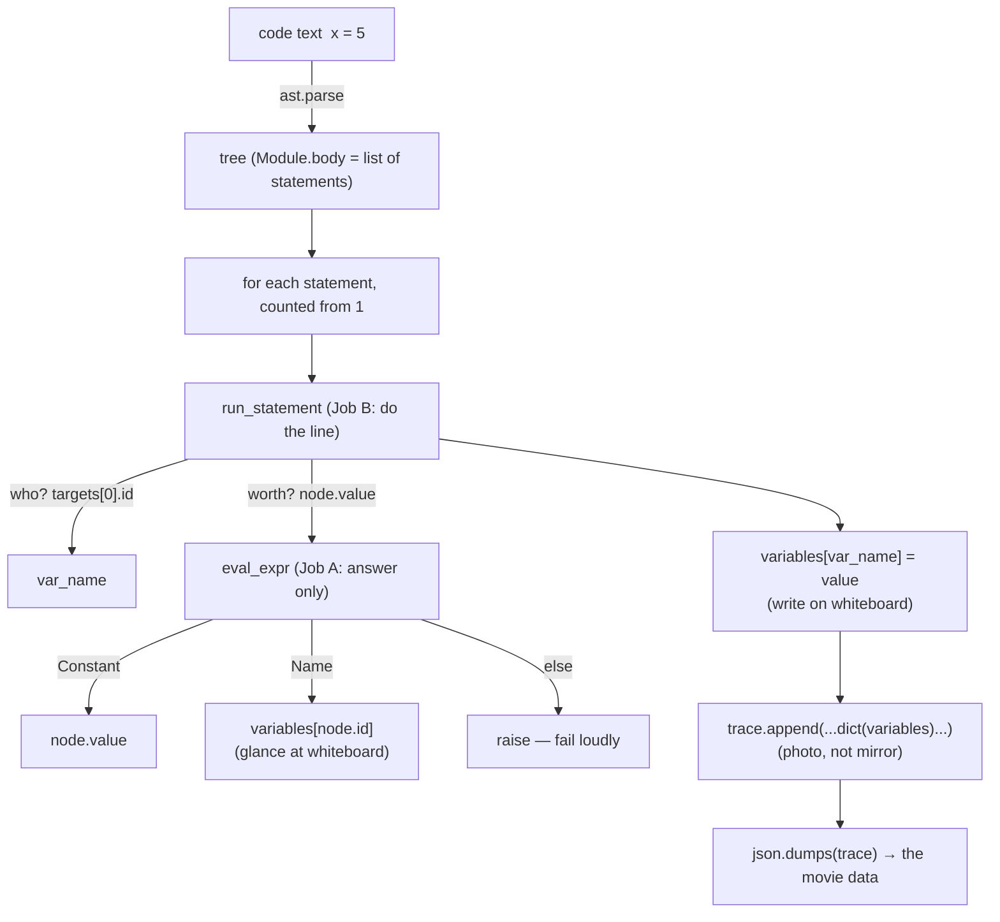

# Day 5 — Start the evaluator + first test thinking

**Date:** 2026-08-13
**Curriculum doc:** `docs/curriculum/01-days-1-to-5.md` (Day 5 block)
**SDET overlay:** `docs/curriculum/sdet-overlay-v1.md` (Day 5 block — first active overlay day)

## Objectives

- **Build:** an evaluator (`tracer.py`) that actually *runs* plain
  assignments (`x = 5`) from the AST and records a trace with copied
  variable snapshots.
- **SDET:** understand what software testing *is* — expected vs actual,
  assertion, test scenario vs test case, happy vs negative path — and
  practice writing the expected result BEFORE running the code.

## Concepts & definitions

- **Evaluator** — the piece of code that actually *does* what the tree
  describes. Analogy: the AST is the recipe; the evaluator is the cook.
  Days 3–4 we only read recipes — today we cook for the first time.
- **Expected vs actual (what testing is)** — deciding what the correct
  answer is *before* running the code, then comparing it with what the
  code really produced. Analogy: an answer key you fill in before
  grading the homework — if you grade by just reading the student's
  answer and nodding, everything looks correct.

## Q&A log

- **Sai:** "I'm blank, I didn't understand the questions" (on
  predicting the expected trace). Attempt given: "2 steps. Constants,
  x and y of value 5 and 3" — step count correct, but the *structure*
  of a trace step wasn't known. → Missing prerequisite identified:
  what one trace step contains (Day 1 saw it only briefly).
- **Reteach:** trace = a **diary** the evaluator writes, one entry per
  line that runs. Each entry has 5 fields: `step` (which entry),
  `line` (which code line ran), `event` (what kind of thing happened),
  `changed` (what this line alone changed), `variables` (a **photo of
  ALL variables** at that moment). Key contrast: `changed` = this line
  only; `variables` = full scoreboard so far. Worked example given for
  `a = 7`, then Sai asked to fill in the two steps for `x = 5\ny = 3`.
- **Sai's second attempt: correct.** Both steps filled in right,
  including the key insight — step 1 `variables` = `{"x": 5}` only
  (no `y` yet), step 2 = `{"x": 5, "y": 3}`. Minor fix: `assign`
  needs quotes in JSON (`"assign"`). Named what happened: this table
  IS the **expected result**, written before the code exists — the
  hard half of a test.

## SDET exercise — expected trace (Sai's answer key)

For input `x = 5\ny = 3`:

| step | line | event | changed | variables |
|---|---|---|---|---|
| 1 | 1 | assign | `{"x": 5}` | `{"x": 5}` |
| 2 | 2 | assign | `{"y": 3}` | `{"x": 5, "y": 3}` |

Next: "what could go wrong" — Sai asked for 3 breaking inputs, given
that the evaluator only supports literal assignment (`x = 5`) and
variable copy (`y = x`).

## SDET exercise — Sai's 3 breaking inputs (all valid!)

Each one breaks a *different layer*:

| # | Input | What breaks | Layer |
|---|---|---|---|
| 1 | `x==5` then `y=x` | Comparison, not assignment — legal Python, but our evaluator was never taught this shape | `run_statement` (statement handler) |
| 2 | `y=x` then `x=5` | Using `x` before it exists — lookup fails (KeyError) | `eval_expr` (value lookup) |
| 3 | `x=` then `y=x` | Not legal Python at all — `ast.parse` refuses with `SyntaxError` | Parser (before evaluator runs) |

Teaching point: professional testers ask not "does it work?" but
"*where* can it break?"

- **New terms:** **happy path** (input the code was designed for —
  the `x = 5\ny = 3` answer key) vs **negative path** (inputs designed
  to go wrong — the 3 breakers). **isinstance(thing, Type)** — asks
  "is this thing of this type?", returns True/False.

## Build phase

- **Sai:** "help me understand what we are doing in simpler terms"
  (before typing eval_expr). → Zoomed out with the **teacher at a
  whiteboard** analogy: the whole app = a movie of code running;
  Day 1–2 the movie was faked (hardcoded JSON); today we build the
  camera crew. `variables` = the whiteboard (current values);
  `trace` = the photo album (one photo per line acted out).
  `eval_expr` = Job A: "what does the right side of `=` amount to?"
  (number → hand it back; variable → glance at whiteboard).
  `run_statement` (next) = Job B: write on whiteboard + take photo.
  Understanding check asked: what does eval_expr return for Name('x')
  when whiteboard says x:5, and for Constant(3)?
- **Sai answered "5 and 3" — correct.** Understanding of eval_expr's
  job confirmed before typing.
- **Sai:** "for elif I think I need help with simpler explanation" →
  new concept taught from scratch. **if/elif/else = a chain of
  questions asked top to bottom; first "yes" wins and the rest are
  skipped; `elif` = "else if" (only asked if the previous was a no);
  `else` = catch-all with no question.** Analogy: getting dressed —
  if raining → raincoat; elif cold → jacket; else → t-shirt.
  Check question posed: raining AND cold at once → which branch runs?
  (tests rule "first yes wins"). **Sai answered "raincoat" — correct;
  elif understood and demonstrated.**
- **First typed version of `eval_expr` reviewed.** Right: skeleton
  structure, `node.value` for Constant, loud `raise` in else. Fixed
  after review: (1) `variables = []` → must be `{}` — new concept
  taught: **list `[]` = row of numbered boxes, get by position
  (`box[0]`); dictionary `{}` = labeled boxes, get by name
  (`box["x"]`)**. Memory hook: trace = photo album (list), variables =
  whiteboard with names (dict). (2) `return []` placeholder →
  assembled `variables[node.id]` from pieces (dictionary[key], dict is
  `variables`, key lives in `node.id`) — Sai fixed this one correctly
  on the first try.
- **`eval_expr` complete.** Piece 3 assigned: `run_statement` skeleton
  with 3 blanks (A: `node.targets[0].id` — targets is a list because
  `x = y = 5` is legal; B: call `eval_expr(node.value)`; C: the
  whiteboard photo — deliberately left open so the copy-vs-reference
  bug can be discovered live via the answer key, per SDET overlay).
  New syntax taught: `trace.append(...)` = add photo to album;
  `len(trace) + 1` = next photo number; `{...}` literal builds a dict
  on the spot; `variables[var_name] = value` = dictionary WRITE (twin
  of the read `variables[node.id]`).
- **Sai:** "give me full answer for this, am getting slightly
  confused" → answers assembled layer-by-layer instead of dumped:
  A = `node.targets[0].id` (dig table: node → .targets is the list →
  `[0]` first item → `.id` the string 'x'); B =
  `eval_expr(node.value)` (Job B asks Job A for help); C = told to
  write the *obvious* answer `"variables": variables` — with the
  explicit setup that the morning answer key will judge whether the
  obvious answer is correct (copy-vs-reference discovery staged).
  Price of the answers: Sai must explain back (why `targets[0]`?
  what does `value = eval_expr(node.value)` do?).
- **Explain-back answers:** (1) correct — targets is the whole list,
  `[0]` gets the first item. (2) right result, one word corrected:
  eval_expr **answers**, never **stores** — the storing is the next
  line (`variables[var_name] = value`). "eval_expr glances and
  calculates; it never picks up the marker."
- **run_statement review:** all 3 blanks correct. Missing: the `else`
  + `raise` branch — tied back to Sai's own breaker #1 (`x==5`):
  without it, unknown statements would *silently do nothing* (worst
  kind of bug). Sai adding it.
- **Driver assigned** (typed by Sai): `code = "x = 5\ny = 3"` →
  `ast.parse` → `for line_number, statement in
  enumerate(tree.body, start=1)` → `run_statement` → `json.dumps`.
  New concepts: `\n` = the Enter key in a string; `for ... in` = once
  per item; `enumerate(start=1)` = loop + counter together;
  `json.dumps(trace, indent=2)` = album → readable JSON text.

Sai now writing `backend/tracer.py` from understanding (not copying):
Piece 1 = `variables` dict (scratchpad) + `trace` list (diary).
Piece 2 = `eval_expr(node)` — Constant → `node.value`; Name → look up
`variables[node.id]`; else raise loudly.

## What we built / ran

- **`backend/tracer.py`** (typed by Sai, piece by piece): `variables`
  dict + `trace` list → `eval_expr` (Constant/Name/raise) →
  `run_statement` (Assign: name → value via eval_expr → whiteboard
  write → snapshot append; else raise) → driver
  (`x = 5\ny = 3` → parse → enumerate loop → json.dumps) → one
  `assert` as the first regression guard. Runs green, matches the
  answer key.
- **`backend/practice_tracer.py`** (consolidation rebuild, typed by
  Sai): same evaluator, driver program `p = 4\nq = p\nr = 7` —
  exercises BOTH eval_expr branches. Run matched Sai's own 3-step
  answer key exactly.
- Commands: `python tracer.py` (×4: bug run, fixed run, assert-green,
  assert-catches-bug) · `python practice_tracer.py` (green, 3/3).

### How the tracer works (flow)

## SDET section

- **SDET concepts learned:** expected vs actual (decided BEFORE the
  run) · answer-key-first habit · happy vs negative path · assertion
  (`assert` = "I claim — verify or crash"; silence = pass) · test
  scenario vs test case (headline vs exact input + exact expected;
  litmus: "can you execute it right now without inventing data?") ·
  regression + regression test (kept-forever guard against a fixed
  bug returning) · pytest conceptually (finds tests, runs asserts,
  reports green/red — hands-on Day 6) · failures live in layers
  (parser / statement handler / value lookup).
- **Test scenarios identified:** assignment stores values with correct
  per-step snapshots · unsupported statement shapes fail loudly ·
  undefined-variable reads fail loudly · invalid syntax rejected by
  the parser.
- **Test cases written:** happy: `x = 5\ny = 3` → step 1 variables ==
  `{"x": 5}`, step 2 == `{"x": 5, "y": 3}` (paper key → assert) ·
  practice: `p = 4\nq = p\nr = 7` → 3-step key, matched 3/3 ·
  negative (paper): `x==5` → loud "can't run"; `y=x` before x → loud
  lookup failure; `x=` → SyntaxError at parse.
- **Tests implemented / results:** 1 assert in tracer.py (step 1
  snapshot) — green on fixed code; screamed correctly when the bug
  was re-introduced on purpose.
- **Bugs / failures discovered:** the **reference-vs-copy snapshot
  bug** — caught by answer-key comparison, fixed with
  `dict(variables)`, then re-introduced to prove the assert catches
  it. Plus a practice-file slip (`node.variables[node.id]`) Sai found
  and fixed independently before running.
- **Edge cases:** read-before-write; invalid syntax (parser layer);
  statement shapes beyond the two supported.
- **Regression considerations:** the snapshot assert is the project's
  first permanent regression guard; graduates into a pytest suite on
  Day 6.
- **Interview takeaway:** "What is testing?" → expected vs actual,
  decided before the run. Scenario vs case via Sai's own login-page
  example. Regression = the bug coming back.
- **Concepts needing reteaching (all landed after a 2nd pass):**
  `changed` vs `variables` (marker stroke vs photo) · scenario vs
  case (exact values make the case) · input vs expected direction
  (input = program text fed in; expected = trace out). **Lagging
  muscle: writing from a blank page** (recall vs recognition) —
  concepts ~L4–5, unaided syntax production ~L3; homework targets it.

- **First run of `python tracer.py`: SUCCESS with a bug.** Program ran
  clean (2 steps, no crash) — but **step 1's `variables` shows
  `{"x": 5, "y": 3}`**, while the answer key written this morning says
  step 1 should be `{"x": 5}` only. Expected vs actual caught a real
  bug on the first try — the answer key did its job. Sai asked to
  spot and describe the mismatch before the cause (reference vs copy)
  is taught.
- **Sai spotted the mismatch correctly:** "step 1 has variables x:5
  [in the key], but here step 1 has both x and y."
- **Cause taught — reference vs copy:** `"variables": variables`
  stores a **link to the whiteboard itself, not a copy** — like
  putting a **mirror in the album instead of a photo**; every page
  shows the whiteboard as it is *now*, so the past silently changes.
  Rule: **`=` with a dictionary shares (a *reference*); it never
  copies.** Tiny proof: `a = {"x": 5}; b = a; a["y"] = 3` → `b` shows
  `y` too — only one dict ever existed. **Fix:** `dict(variables)` =
  build a brand-new dict copying the current contents — a frozen
  snapshot, a real photo. Sai applying the one-line fix and re-running
  for the re-grade against the answer key.
- **Fix applied (with a why-comment Sai wrote) — re-run: MATCH.** All
  fields of both steps agree with the morning answer key. Full SDET
  cycle completed: expected first → actual → mismatch = real bug →
  fix → expected == actual.
- **New concept — assertion:** `assert trace[0]["variables"] ==
  {"x": 5}, "step 1 snapshot is wrong"` = "I claim — verify or crash."
  Silence = pass. Exercise assigned: (1) run green; (2) re-introduce
  the reference bug on purpose and watch the assert catch it
  automatically; (3) restore the fix, confirm green. (This is the
  regression-test punchline: the check that guards against the bug
  coming back.)
- **Bug re-introduced deliberately — assert CAUGHT it:**
  `AssertionError: step 1 snapshot is wrong`, while the printed trace
  itself still looked plausible. Lesson landed: the machine caught the
  bug, not the eyes. Restoring the fix next.
- **Final concepts taught:** **test scenario** (what to test:
  "assignment records correct snapshots") **vs test case** (exact
  input + exact expected: "`x = 5\ny = 3` → step 1 variables ==
  `{'x': 5}`") — one scenario spawns several cases. **Regression** = a
  bug that comes back / new code breaking old behavior; **regression
  test** = a kept-forever re-run guard (today's assert IS one — proved
  live). **pytest** (conceptual only, hands-on Day 6): a program that
  finds test files, runs all asserts, reports green/red per test —
  "the album for your answer keys."
- Done-when check posed: (1) scenario vs case with today's examples;
  (2) why the assert is a regression test, not a one-time check.
- **Sai requested a simplified Days 1–5 recap + one more worked
  example to retry independently.** Given: 5-beat story (fake trace →
  trees → tree tool → evaluator with whiteboard/album → expected vs
  actual) and a fully worked trace of `a = 10\nb = a` (uses BOTH
  eval_expr branches — line 2's right side is a `Name`, resolved by
  glancing at the whiteboard). Independent exercise assigned:
  `p = 4\nq = p\nr = 7` — write the 3-step answer key, predict which
  eval_expr branch fires per line, then edit `code =` in tracer.py,
  run, and self-grade (assert temporarily commented out — it encodes
  the other program's expectation).
- **Sai asked for an explicit numbered ladder instead** ("what file to
  create, and do it") → consolidation exercise restructured: rebuild
  the tracer fresh in `backend/practice_tracer.py` via a 7-step
  ladder (containers → eval_expr → run_statement → driver with
  `p = 4\nq = p\nr = 7` → answer key BEFORE running → run + grade).
  Ground rule: Sai types everything; peeking at their own working
  `tracer.py` is allowed (referencing your own code = real practice);
  Claude typing it is not.
- Sai asked for the complete practice-file code in chat → provided
  (all pieces already built + explained by Sai once today), with the
  condition it is TYPED by hand, and the answer key still comes
  before the first run.
- **Practice answer key, attempt 1** (`p = 4\nq = p\nr = 7`): step 1
  fully correct. Misunderstanding found in steps 2–3: `changed`
  accumulated history instead of only this line's write. Reteach:
  **`changed` = the single marker stroke just made; `variables` = the
  photo of the whole whiteboard after it.** Slips: `r = 7` written as
  `"8"` (wrong value + quotes make it text); `"q=4"` as one blob
  instead of `"q": 4`. Sai redoing rows 2–3.
- **Attempt 2: rows 2–3 correct** (`changed` = one stroke; photos
  accumulate). Key locked before running.
- **Practice run: PERFECT MATCH, 3/3 steps** against Sai's own key.
  Notable: an earlier draft had `return node.variables[node.id]` in
  the Name branch (would crash on `q = p`) — Sai found and fixed it
  independently before running. Second full expected-vs-actual cycle
  of the day, this time nearly unaided.
- Done-when gate re-posed (scenario vs case with today's examples;
  why the assert is a regression test).
- **Sai:** "give me line by line what it does... topic itself I
  understood but while writing code am struggling." → Named the gap:
  **reading = recognition (easy), writing = recall (hard); the
  writing muscle always lags.** Bridge technique taught: **say the
  English sentence first, then spell it in Python** ("glance at the
  whiteboard" → `variables[node.id]`). Full line-by-line
  English-sentence script of the tracer provided in chat (each line
  as its say-it-out-loud sentence: toolkits → whiteboard/album →
  Job A's three questions → Job B's who/worth/write/photo →
  driver's text→tree→act-out-each-line→print). Homework will include
  a blank-page rebuild to train recall.

## Check-your-understanding

- Trace prediction for `x = 5\ny = 3`: **correct** (after the
  diary/photo reteach), including per-step snapshots.
- elif check "raining AND cold" → "raincoat": **correct** (first yes
  wins).
- eval_expr returns for `Name('x')` (whiteboard x:5) and
  `Constant(3)`: "5 and 3" — **correct**.
- Why `targets[0]`: **correct**. What `eval_expr(node.value)` does:
  right result; "stores" corrected to "answers".
- Bug spotting: found the step-1 mismatch against the key **unaided**.
- Scenario vs case: landed via Sai's own login-page example after
  refinement ("exact values make it a case"). Regression: **correct**
  ("catches the bug whenever it comes back").
- Final gate test case: input `x = 5` → expect step 1 variables ==
  `{"x": 5}` (direction corrected once: input = code, expected =
  trace).

## Wrap-up

- **Summary:** built the first real evaluator (assignment-only) and
  ran the first genuine SDET cycle — answer key first, run, mismatch,
  real bug (reference vs copy), fix, green, then a live-proven
  regression assert. Rebuilt the whole tracer once more in a practice
  file and matched a self-written 3-step key 3/3.
- **What Sai learned:** evaluator concept · dict vs list · if/elif/else
  · isinstance · f-strings · for/enumerate · `\n` · dict read/write ·
  append/len · reference vs copy + `dict()` snapshot · expected vs
  actual · assertion · happy/negative path · scenario vs case ·
  regression testing · pytest (concept) · "say the English sentence,
  then spell it in Python".
- **What we built:** `backend/tracer.py` (with why-comment + assert),
  `backend/practice_tracer.py`, these notes.
- **Homework (recall training):** tomorrow morning, blank file, no
  peeking until stuck: rebuild the tracer from the English sentences
  (containers → Job A → Job B → driver), any 2–3-line program of your
  own choosing, answer key BEFORE the run. Peek only after trying —
  then close the reference and finish the section by hand.
- **Suggested commit** (Sai runs it; includes today's CLAUDE.md v1.1 +
  the SDET overlay doc + progress-marker update):
  `git add -A` then
  `git commit -m "day-05: first evaluator (assignment tracing) + first test thinking"`
  then `git tag -a day-05 -m "Day 5: first evaluator + first test thinking"`
  then `git push --follow-tags`.
- **Teaching feedback from Sai (recorded to memory):** the photo/album
  analogy didn't land — change example styles from next session;
  prefer real-software examples (like the login page Sai produced).
- **Prep for tomorrow (Day 6, doc 02):** evaluator learns arithmetic
  (`+ - * /` — the `BinOp` node previewed on Day 3) and more data
  types; SDET goes hands-on with **pytest** and systematic input
  design (equivalence partitioning, boundary values). One thought to
  sleep on: how many different additions would you test — and why not
  fifty?
